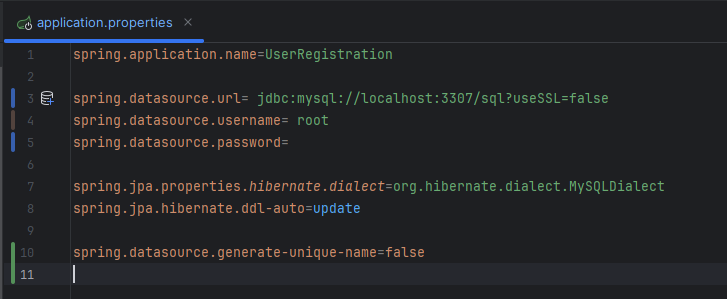

[](https://classroom.github.com/a/mwszR8OO)
# User Registration

A simple user login and registration form website.

## Usage

It uses a sql table in phpMyAdmin to save login information. You will have to set up the Apache configuration in your XAMPP Control Panel to match the datasource location.



Run the Java application and go to your browser and type

```bash
localhost:8080
```
